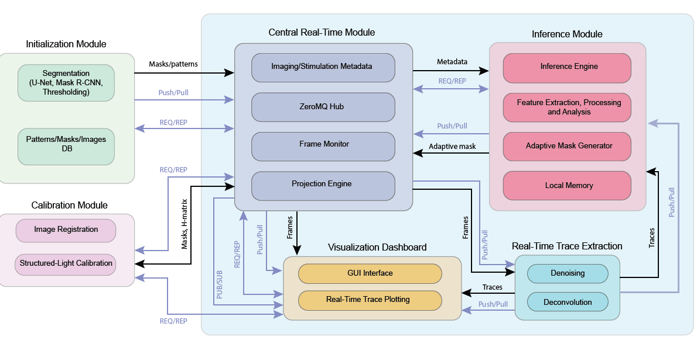

# Architecture

The STIMscope platform is a synchronized control + analysis system for
all-optical neural interrogation: camera + DMD-patterned-light
projector + on-DMD illumination + per-pattern trigger sync + live
analysis, all coordinated from a Qt GUI on NVIDIA Jetson.

*Fig 4a — CRISPI software architecture: six cooperating modules —
**Initialization** (segmentation, masks/patterns DB), **Calibration**
(image registration + structured-light), **Central Real-Time**
(imaging/stimulation metadata, ZeroMQ hub, frame monitor, projection
engine), **Inference** (feature extraction → adaptive mask generation +
local memory — preprint's future closed-loop extension point, scaffolded
but not implemented in this release; see preprint Discussion),
**Real-Time Trace Extraction** (denoising, deconvolution), and the
**Visualization Dashboard** (GUI interface + live plotting). All
inter-module data flow is over ZeroMQ (PUSH/PULL, REQ/REP, PUB/SUB).*

Two views of the same system: the **conceptual architecture** describes
how the platform is organized in lab terms (modules + data flow); the
**implementation architecture** describes how that maps onto the code
on disk. For the file-by-file map, see
[`docs/IMPLEMENTATION_NOTES.md`](https://github.com/Aharoni-Lab/STIMscope/blob/main/docs/IMPLEMENTATION_NOTES.md).

---

## Conceptual architecture

The platform is organized as the six modules above (preprint Fig 4a),
communicating over ZeroMQ. Each module is independent; the wiring
lets them be combined for closed-loop experiments or used standalone
for, e.g., offline segmentation alone. In this release
the **Inference Module** is scaffolded only — the wire and interfaces
exist, but the inference algorithms themselves are the preprint's
future-work extension point (preprint *Discussion* — "not implemented
in the current version").

### Module responsibilities

| Module | What it does |
|---|---|
| **Offline Initialization** | Segments recorded TIFFs into ROIs (Otsu / Cellpose); outputs `rois.npz` and pattern data for downstream use. |
| **Calibration** | Aligns camera pixels to projector pixels. Provides ArUco/ChArUco DMD-projected fiducial registration, Affine-SIFT feature-matching, and structured-light sub-pixel LUT calibration. Outputs a 3×3 homography and/or per-pixel LUT. |
| **Central Real-Time (CRT) Engine** | Runs the closed-loop. Hosts the ZMQ hub, the imaging/stim metadata stream, the projector engine, and the frame monitor. Coordinates all hardware. |
| **Real-Time Trace Extraction** | Per-ROI trace extraction with optional ΔF/F₀ / z-score / OASIS online deconvolution. Pushes traces to the visualization dashboard and the comprehensive export. |
| **Visualization Dashboard** | Operator-facing GUI: live frame view, per-ROI trace plots, experiment controls, calibration interface, recording controls. |
| **Hardware Diagnostics** | Pixel-probe, R/B isolation, LUT-diagnostic, and trigger-pulse tools for validating the optical + electronic loop. |

### Communication patterns

ZMQ throughout. Three patterns in use:

| Pattern | Used by | Purpose |
|---|---|---|
| `PUSH / PULL` | GUI → CRT (masks), CRT → RTTE (frames) | Streaming data (frames, masks, traces) |
| `REQ / REP` | Calibration ↔ CRT | One-shot synchronous transactions (homography updates) |
| `PUB / SUB` | CRT → operator panel | Status broadcasts (per-pattern pidx/vis_id, engine state) |

For the wire-level details (exact endpoints, message formats, I²C
opcodes), see [Hardware Interfaces](Hardware-Interfaces).

---

## Implementation architecture

The conceptual modules above land in the codebase as the Qt GUI
runtime plus the C++ projector engine. Both halves run inside the
Docker image; they talk to each other via the three ZMQ sockets.

### GUI runtime (`STIMscope/STIMViewer_CRISPI/`)

The operator-facing path. Boots on `docker-compose up gui`. Owns the
IDS Peak camera acquisition, the autonomous DMD→camera calibration
flow, live trace extraction, recording, and all GUI dialogs. Entry
point chain:
[`main_gui.pyw`](https://github.com/Aharoni-Lab/STIMscope/blob/main/STIMscope/STIMViewer_CRISPI/main_gui.pyw)
→ [`main.py`](https://github.com/Aharoni-Lab/STIMscope/blob/main/STIMscope/STIMViewer_CRISPI/main.py)
→ [`qt_interface.py`](https://github.com/Aharoni-Lab/STIMscope/blob/main/STIMscope/STIMViewer_CRISPI/qt_interface.py),
which composes mixins from
[`qt_interface_mixins/`](https://github.com/Aharoni-Lab/STIMscope/tree/main/STIMscope/STIMViewer_CRISPI/qt_interface_mixins)
(see that directory for the current mixin set).

Key subsystems:

| Concern | File / module |
|---|---|
| Camera | [`camera.py`](https://github.com/Aharoni-Lab/STIMscope/blob/main/STIMscope/STIMViewer_CRISPI/camera.py) (`OptimizedCamera(QObject)` emitting Qt signals) |
| Recording | [`video_recorder.py`](https://github.com/Aharoni-Lab/STIMscope/blob/main/STIMscope/STIMViewer_CRISPI/video_recorder.py) |
| Calibration (ArUco/ChArUco) | [`calibration.py`](https://github.com/Aharoni-Lab/STIMscope/blob/main/STIMscope/STIMViewer_CRISPI/calibration.py) (typed `CalibrationResult`; no silent identity fallback) |
| Calibration (structured-light) | [`qt_interface_mixins/sl_calibrate.py`](https://github.com/Aharoni-Lab/STIMscope/blob/main/STIMscope/STIMViewer_CRISPI/qt_interface_mixins/sl_calibrate.py) |
| Projector wire (Python side) | [`projector_client.py`](https://github.com/Aharoni-Lab/STIMscope/blob/main/STIMscope/STIMViewer_CRISPI/projector_client.py); endpoints in [`CS/core/projector.py`](https://github.com/Aharoni-Lab/STIMscope/blob/main/STIMscope/STIMViewer_CRISPI/CS/core/projector.py) |
| Live trace extraction | [`gpu_ui.py`](https://github.com/Aharoni-Lab/STIMscope/blob/main/STIMscope/STIMViewer_CRISPI/gpu_ui.py) + [`gpu_ui_mixins/`](https://github.com/Aharoni-Lab/STIMscope/tree/main/STIMscope/STIMViewer_CRISPI/gpu_ui_mixins) + [`live_trace/`](https://github.com/Aharoni-Lab/STIMscope/tree/main/STIMscope/STIMViewer_CRISPI/live_trace) |
| Temporal R/B alternator | [`qt_interface_mixins/triggers.py`](https://github.com/Aharoni-Lab/STIMscope/blob/main/STIMscope/STIMViewer_CRISPI/qt_interface_mixins/triggers.py) (`_start_temporal_alt_thread`) |
| GPIO trigger lines | env vars `STIM_GPIO_CHIP` / `STIM_CAM_LINE` / `STIM_PROJ_LINE`; consumed where the engine subprocess is launched in `triggers.py` |
| DLPC3479 I²C driver | [`ZMQ_sender_mask/dlpc_i2c.py`](https://github.com/Aharoni-Lab/STIMscope/blob/main/STIMscope/ZMQ_sender_mask/dlpc_i2c.py) |

### C++ projector engine (`STIMscope/ZMQ_sender_mask/main.cpp`)

Single translation unit driving the DMD over OpenGL + GLFW. Exposes a
ZMQ PULL socket for incoming mask frames, a REP socket for homography
updates, a PUB socket for engine status, and GPIO trigger lines via
`libgpiod`. The GUI talks to it over ZMQ; it owns the DMD via the
DLPC3479 I²C protocol.

---

## Tech stack — capability → algorithm → packages

| Capability | Algorithm / standard | Key packages |
|---|---|---|
| Camera capture | GenICam — IDS Peak USB3 SDK | `ids_peak`, `ids_peak_ipl`, `ids_peak_afl` |
| Projection wire | ZMQ PUSH (mask frames), REQ/REP (homography), PUB/SUB (engine status) | `pyzmq` |
| DMD pattern control | TI DLPC3479 I²C (DLPU081A datasheet) | `smbus2`, custom Python driver |
| GPIO triggers | Linux gpiochip via libgpiod | `Jetson.GPIO` (host) / `libgpiod` (C++ engine) |
| Calibration (DMD-projected fiducial) | ArUco / ChArUco | `opencv-python`, `numpy` |
| Calibration (feature) | SIFT / ORB / Affine-SIFT | `opencv-python` |
| Calibration (LUT) | Structured-light sinusoidal phase patterns | `numpy`, custom decoder |
| Recording | TIFF stacks (compression-mode env-tunable) | `tifffile`, `imagecodecs`, `opencv` |
| Trace extraction (RTTE) | Per-ROI mean reduction; live plotting; OASIS online deconvolution | `numpy`, `pyqtgraph`, `cupy` (optional) |
| Segmentation — classic | Otsu thresholding ± watershed | `opencv`, `scikit-image` |
| Segmentation — deep | Cellpose generalist + custom models | `cellpose` (optional dep) |
| GUI shell | Qt5 with mixin composition | `PyQt5`, `pyqtgraph` |
| Test harness | pytest + property-based + offscreen Qt | `pytest`, `hypothesis`, `pytest-cov`, `pytest-xdist` |
| Security gate | Static + dependency scanning | `bandit`, `pip-audit` |
| Container | NVIDIA L4T base image (JetPack 5 or 6) | `nvcr.io/nvidia/l4t-jetpack` |

---

## Conventions across the stack

- **ZMQ is the Python ↔ C++ wire.** All projector control flows
  through three ZMQ sockets (PUSH for mask frames, REQ/REP for
  homography, PUB for engine status). Endpoints are defined in
  [`CS/core/projector.py`](https://github.com/Aharoni-Lab/STIMscope/blob/main/STIMscope/STIMViewer_CRISPI/CS/core/projector.py).
  No FFI, no shared memory, no pipes. See
  [Hardware Interfaces](Hardware-Interfaces#projector--python--c-zmq).
- **LED routing is DMD-internal.** RED / BLUE channel selection
  happens via DLPC3479 I²C (`0x96` Illumination Select), not via
  per-LED GPIO pins. The `LED Color` dropdown is the operator-facing
  surface; see [Features · LED color routing](Features#led-color-routing-dmd-internal).
- **GPIO is for trigger lines only.** Camera-trigger and
  projector-trigger lines are env-overridable
  (`STIM_GPIO_CHIP` / `STIM_CAM_LINE` / `STIM_PROJ_LINE`) so the same
  image runs on different carrier boards without recompilation.
- **Hardware degradation is silent + visible.** Missing IDS Peak SDK,
  missing CUDA, missing GPIO chip → the relevant codepath logs a
  one-line warning and falls back. Simulation-friendly modes (offline
  segmentation, trace replay on saved video) are always available.
- **Mixin composition for QWidget hosts.** The
  [`qt_interface_mixins/`](https://github.com/Aharoni-Lab/STIMscope/tree/main/STIMscope/STIMViewer_CRISPI/qt_interface_mixins)
  classes don't have their own `__init__`; they expect the host class
  to provide a `QtWidgets.QMainWindow` self and certain state
  attributes. Same pattern in
  [`gpu_ui_mixins/`](https://github.com/Aharoni-Lab/STIMscope/tree/main/STIMscope/STIMViewer_CRISPI/gpu_ui_mixins)
  and [`live_trace/`](https://github.com/Aharoni-Lab/STIMscope/tree/main/STIMscope/STIMViewer_CRISPI/live_trace).
- **Hedged documentation language.** "Current implementation does X"
  rather than "X is guaranteed."
- **Portability via environment variables.** Every machine-specific
  value (data root, I²C bus, GPIO chip + lines, default fps/exposure,
  recording format, temporal-mode phase) is an env var read at
  startup. See [Portability](Portability).
