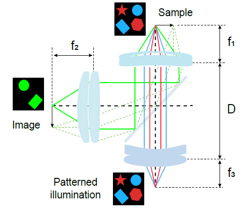

# Features

What the platform can do. Each section is a first-class capability that
operators use independently — not a sequence. The order in which a given
experiment uses these depends on the experimental design.

For the per-control reference (every button, dropdown, spinbox, tooltip),
see [GUI Reference](GUI-Reference). For the architectural overview, see
[Architecture](Architecture).

*Fig 1c — Optical layout: dual-tandem lens train. Imaging side
demagnifies (M = f₂/f₁), excitation side relays the DMD's patterned
illumination (M = f₁/f₃) through a custom dual-band dichroic onto the
sample. Optimal f-number f/4, Nikon F-mount.*

---

## 1. Camera acquisition

### Camera support

The GUI's `Camera Type` dropdown supports three backends:

- **IDS Peak** — IDS USB3 industrial camera (default; covered by
  [`STIMscope/STIMViewer_CRISPI/camera.py`](https://github.com/Aharoni-Lab/STIMscope/blob/main/STIMscope/STIMViewer_CRISPI/camera.py)
  + the IDS Peak SDK)
- **MIPI** — MIPI-attached camera path
- **Generic Camera** — fallback path

### Acquisition modes

- **Real-time (RT)** — free-running at the configured frame rate
- **Hardware-triggered** — one frame per trigger edge on a configurable
  GenICam line (`Line0` / `Line1` / `Line2` / `Line3`)
- **Software snapshot** — single-frame capture via the `Snapshot` button

### Default operating point

At camera open the GUI commits a sensible default frame-rate and
exposure so the operator can start acquiring immediately. The defaults
are env-overridable; see
[`camera.py`](https://github.com/Aharoni-Lab/STIMscope/blob/main/STIMscope/STIMViewer_CRISPI/camera.py)
for the variable names (`STIM_DEFAULT_FPS_HZ`, `STIM_DEFAULT_EXP_US`)
and current values.

### Per-frame controls

- Exposure (µs) — slider + typed-entry; live readback on dialog open
- Analog gain (dB) — brightness control
- Digital gain
- Hardware contrast / hardware gamma — surfaced for cameras that expose
  the GenICam nodes (the GUI checks node availability and disables the
  control if absent)
- Trigger source dropdown (`Line0` … `Line3`)
- Trigger activation: `RisingEdge` / `FallingEdge` / `LevelHigh` /
  `LevelLow` (via Trigger-Params dialog)
- Trigger delay + exposure time presets (Blue sub-frame /
  Full frame) and manual entry

### Orientation (camera vs mask are independent)

| Control | What it affects |
|---|---|
| `Rotate 90°` | Camera preview rotation only |
| Camera `Flip H` / `Flip V` | Camera preview + recording |
| Mask `Flip H` / `Flip V` | Outgoing DMD projection mask only; auto-restarts the mask sender |

---

## 2. Recording & replay

- **Recording** — TIFF stack of every frame in the live feed
- **Snapshot** — saves the next processed frame as a single image
- **In-app viewer** — `View Recording` opens a saved TIFF with frame
  slider + auto-contrast
- **External viewer** — `Open in External Viewer` launches the system
  image viewer on the most-recent recording
- **Save Current View (TIFF)** — for diagnostic dialogs that render
  their own image content (Troubleshooting)

Compression mode, queue depth, batching, BigTIFF, grayscale, and the
output directory are env-tunable — see the top of
[`video_recorder.py`](https://github.com/Aharoni-Lab/STIMscope/blob/main/STIMscope/STIMViewer_CRISPI/video_recorder.py)
for the current variable list (`STIM_TIFF_COMPRESSION`,
`STIM_REC_QMAX`, `STIM_REC_BATCH`, `STIM_TIFF_BIGTIFF`,
`STIM_TIFF_GRAYSCALE`, `STIM_SAVE_DIR`). Sustained recording fps at
the camera's full frame size is bounded by the host's disk substrate
— see [Portability](Portability) for the storage note.

---

## 3. DMD patterned projection

### The projector engine

A custom C++ binary at
[`ZMQ_sender_mask/main.cpp`](https://github.com/Aharoni-Lab/STIMscope/blob/main/STIMscope/ZMQ_sender_mask/main.cpp)
drives the DMD over OpenGL + GLFW. The GUI starts and stops it from
the main button bar:

- `Start Projection Engine` — spawns the engine + binds ZMQ ports
- `Project ON` / `Project OFF` — toggle pattern display without
  stopping the engine
- `Clear Projector` — push an all-black frame
- `Start Projector Trigger` — start asserting per-pattern GPIO trigger
  edges
- `HW Trigger Out` — toggle per-pattern GPIO output for downstream
  sync (camera, scope, external DAQ); the GPIO line is configured at
  engine launch
- `Send Masks` — start/stop streaming masks over ZMQ
- `Send Mask Pattern` — browse + queue a single mask file

### Sequence types

Configurable via the `Sequence Type` dropdown in the projection
controls.

### Stim mode selection

`Stim Mode` dropdown chooses how stim and observe windows interleave.
Multiple modes available; the chosen mode determines DMD frame
ordering, which DMD color channel is selected per sub-frame, and
camera trigger timing.

### LED color routing (DMD-internal)

`LED Color` dropdown chooses the DMD illumination channel for the
**initial pattern** at `Start Projector Trigger`. The dropdown items
and their underlying DLPC3479 Illumination Select bytes are defined at
[`qt_interface_mixins/button_bar.py`](https://github.com/Aharoni-Lab/STIMscope/blob/main/STIMscope/STIMViewer_CRISPI/qt_interface_mixins/button_bar.py)
(`_led_color_dropdown`): RED (stim), BLUE (observe), R+B (alignment),
RGB (diagnostic).

LED routing on this platform is **DMD-internal**, not GPIO-pin-per-LED:
the DLPC3479 selects which on-board LED bank illuminates each sub-frame
via I²C opcode `0x96` byte 3. Fast per-frame alternation (red-stim /
blue-observe) is driven by the frame scheduler, not by toggling a host
GPIO line.

### Temporal R/B alternator

When the operator selects Temporal mode, a daemon thread alternates the
DMD's active LED channel between RED and BLUE via
`dlpc_i2c.fast_phase_switch`, so the visible LED tracks the mask-side
alternation. Defined at
[`qt_interface_mixins/triggers.py`](https://github.com/Aharoni-Lab/STIMscope/blob/main/STIMscope/STIMViewer_CRISPI/qt_interface_mixins/triggers.py)
(`_start_temporal_alt_thread`, `_stop_temporal_alt_thread`). Phase
duration is tunable via the `STIM_TEMPORAL_PHASE_MS` environment
variable; the current default is in the source.

### Live homography updates

- `REQ H-Matrix` — sends the current 3×3 calibration to the engine
  over the ZMQ homography sideband
  (`DEFAULT_HOMOGRAPHY_ENDPOINT` in
  [`CS/core/projector.py`](https://github.com/Aharoni-Lab/STIMscope/blob/main/STIMscope/STIMViewer_CRISPI/CS/core/projector.py));
  the engine recomputes its warp LUT
- `REQ LUT` — same idea, but for the structured-light look-up table
- `Project LUT-Warped` — switches projection through the
  structured-light LUT path

---

## 4. Illumination & sync

### Illumination (DMD I²C)

The DMD's on-board LED bank is the illumination source for both
stimulation and imaging. Channel selection is set per-pattern via
DLPC3479 I²C — see §3 *LED color routing* above. There are no separate
GPIO lines for RED / BLUE on this platform; channel selection happens
inside the projector engine.

- **DMD R/B Isolation Test** (main button bar) — verify the RED and
  BLUE DMD channels respond independently.
- **OASIS (Online)** — fast online OASIS calcium deconvolution applied
  to live traces (when present in the build).

### Sync (GPIO via libgpiod)

GPIO is used only for the camera and downstream-sync trigger lines.
The C++ projector engine asserts edges on the lines selected at
startup. All addressing is env-overridable so the same image runs on
different Jetson carrier boards without recompilation:

| Env var | Purpose |
|---|---|
| `STIM_GPIO_CHIP` | Which gpiochip device (default Jetson Orin chip) |
| `STIM_CAM_LINE` | Line that fires the camera trigger |
| `STIM_PROJ_LINE` | Line that drives the projector trigger out |

Defaults are defined where the engine subprocess is launched —
[`qt_interface_mixins/triggers.py`](https://github.com/Aharoni-Lab/STIMscope/blob/main/STIMscope/STIMViewer_CRISPI/qt_interface_mixins/triggers.py).
See [Portability](Portability) for the full env-var surface and
[Hardware Interfaces · GPIO](Hardware-Interfaces#gpio-libgpiod) for
the protocol-layer view.

---

## 5. Calibration suite

*Fig 4b — Calibrated mask projection. Left: the desired
camera-space mask (a 1 mm grid). Middle: the projected DMD pattern
after applying the camera→projector homography H. Right: the camera
observation of the projected pattern overlaid on the requested mask.
Targeting accuracy is **RMS 0.46 px ≈ 1.3 µm**
across ~85 000 targets on a 1936 × 1096 field (Fig 4c).*

Calibration on this platform is **autonomous DMD→camera** — the GUI
projects a calibration target through the DMD, the camera observes
the projected target, and the calibration math is derived from that
projector→camera correspondence. The operator does not need to place
or hold any physical board in the optical path. See
[`qt_interface_mixins/projection_controls.py`](https://github.com/Aharoni-Lab/STIMscope/blob/main/STIMscope/STIMViewer_CRISPI/qt_interface_mixins/projection_controls.py)
(`_calibrate`) and
[`qt_interface_mixins/sl_calibrate.py`](https://github.com/Aharoni-Lab/STIMscope/blob/main/STIMscope/STIMViewer_CRISPI/qt_interface_mixins/sl_calibrate.py)
(`_sl_calibrate`) for the dispatch.

| Method | Button | What it does |
|---|---|---|
| ArUco / ChArUco | `Calibrate` | DMD projects the ChArUco board image; camera observes; 3×3 homography solved by [`calibration.find_homography_aruco`](https://github.com/Aharoni-Lab/STIMscope/blob/main/STIMscope/STIMViewer_CRISPI/calibration.py). Returns a typed `CalibrationResult` (no silent identity fallback). |
| Structured-Light (LUT) | `Structured-Light Calibrate` | DMD projects sinusoidal phase patterns; camera observes; per-pixel projector↔camera LUT decoded for sub-pixel mapping |
| ASIFT (Affine-SIFT) | `ASIFT Calibration` | Feature-matching path used when fiducials are absent (`_asift_calibrate` in [`qt_interface_mixins/calib_projector.py`](https://github.com/Aharoni-Lab/STIMscope/blob/main/STIMscope/STIMViewer_CRISPI/qt_interface_mixins/calib_projector.py)) |
| Push existing H | `REQ H-Matrix` | Send the loaded calibration to the running engine without re-running calibration |
| Push existing LUT | `REQ LUT` | Same idea, for the structured-light LUT |
| Project through LUT | `Project LUT-Warped` | Switch the projection path through the structured-light LUT |

The structured-light path includes a `Subpixel` checkbox for
sinusoidal phase refinement.

---

## 6. Real-Time Trace Extraction (RTTE)

Opened via the `Real-Time Trace Extraction` button. While the camera
is acquiring, the platform extracts per-ROI fluorescence values
frame-by-frame and plots them live.

### Controls

The control inventory below is sourced directly from
[`STIMscope/STIMViewer_CRISPI/gpu_ui.py`](https://github.com/Aharoni-Lab/STIMscope/blob/main/STIMscope/STIMViewer_CRISPI/gpu_ui.py)
and its mixins under
[`gpu_ui_mixins/`](https://github.com/Aharoni-Lab/STIMscope/tree/main/STIMscope/STIMViewer_CRISPI/gpu_ui_mixins).

- `🖼 Select Video…` — pick a TIFF stack for offline replay
- `➤ Make Memmap` — memory-map a large TIFF for low-RAM streaming
- `📂 Load ROI File…` — pick a `rois.npz`
- `▶ Export Traces` — comprehensive export (`traces_*.npz` +
  per-ROI metadata + optional HTML summary)
- `👁️ View Exported Traces` — open a saved export for inspection
- `🌐 Open Full Report in Browser` — render the HTML summary from a
  saved export
- `OASIS (Online)` — checkable button; toggles online OASIS
  deconvolution
- Trace-mode dropdown — `Raw` / `ΔF/F₀` / `z-score` / `Spikes`
- `◀ Previous 10 ROIs` / `Next 10 ROIs ▶` — pagination through ROI
  checkbox list
- Per-ROI `ROI {roi_id}` checkboxes — toggle individual ROI visibility
- `Close` — close the RTTE window

`Clear ROI` lives in the **Trace Test dialog**
([`qt_interface_mixins/trace_test.py`](https://github.com/Aharoni-Lab/STIMscope/blob/main/STIMscope/STIMViewer_CRISPI/qt_interface_mixins/trace_test.py)),
not RTTE.

### Outputs

| File | Contents |
|---|---|
| `traces_*.npz` | Per-ROI buffer + per-ROI metadata (centroid, bbox, color palette index) |
| HTML summary | Multi-section report (system + session + per-ROI grid) — comprehensive mode |

---

## 7. Offline ROI segmentation

The `Offline Setup` dialog turns a recorded TIFF stack into a
`rois.npz` file. Five panels (A–E):

### A. Recording Selection

- `Load Recording` — pick a TIFF stack
- Projection-type dropdown — `Mean` / `Max` / `Std Dev` / `Mean + Std`
- `Compute Projection` — run the projection
- `Save as TIFF` — export the projection (useful for downstream tools)
- "Convert loaded video to TIFF for faster reloading" toggle

### B. Segmentation

Method dropdown picks the segmenter:

- **Otsu thresholding** — classic; with optional `Watershed splitting`
  to separate touching neurons
- **Cellpose** — deep-learning segmentation with selectable model
  (`cyto2` / `cyto` / `nuclei` / `custom`)

Per-method controls:

- Minimum / maximum ROI area as fraction of image
- Gaussian blur kernel size + sigma
- Fill holes smaller than fraction of image area
- Cellpose: cell diameter, flow error threshold, cell probability
  threshold, `Browse` for custom model path
- Frame start / frame end (`0 = all frames`) — skip calibration frames
- `GPU acceleration` checkbox — falls back to CPU if unavailable
- `Run Segmentation`

### C. ROI Visualization

ROI overlay opacity slider.

### D. Target Selection

Target ROI dropdown — pick a ROI of interest for downstream analysis.

### E. Export

- `Save ROIs` — writes the `rois.npz` to the configured save
  directory (`STIM_SAVE_DIR`)

---

## 8. Hardware diagnostics

Top-level buttons:

| Button | Purpose |
|---|---|
| `Pixel Probe` | Project a single bright pixel; verify camera sees it where calibration predicts |
| `Pixel Probe (1px)` | Same, full diagnostics surface in Troubleshooting |
| `DMD R/B Isolation Test` | Verify RED + BLUE DMD channels respond independently |
| `Enable Overlay` | Toggle the camera-on-projection overlay |
| `HW Trigger Out` | Toggle GPIO trigger out on every projector frame (line selected at engine startup; see §4) |
| `Troubleshooting` | Open the troubleshooting menu |

Troubleshooting menu (opened via the `Troubleshooting` button):

| Tool | Action |
|---|---|
| `Test HW Trigger Out Pulse` | One-shot GPIO pulse for scope verification |
| `Start Engine Monitor` | Live readout of projector engine state |
| `Projector Trigger: OFF` indicator | Read-only status pill driven by the engine's ZMQ status socket (`tcp://127.0.0.1:5562`). Text + background update to `GPIO Triggers Detected` (green) when the DMD sequencer is firing triggers, `No GPIO Triggers` (red) when it isn't. Defined in [`troubleshoot.py`](https://github.com/Aharoni-Lab/STIMscope/blob/main/STIMscope/STIMViewer_CRISPI/qt_interface_mixins/troubleshoot.py); not synced to the Start/Stop Projector Trigger button — reflects actual GPIO state. |
| `LUT Diagnostics` | Validate the structured-light LUT |
| `Project Grid (LUT)` | Project a known grid through the LUT |
| `Capture + Evaluate` | Project + capture + measure pixel error |
| `Round-Trip Error (Maps)` | Per-pixel round-trip-error heat map |
| `Dot Array Test` | Project + capture + localize a dot array |
| `Round-Trip (Physical)` | Round-trip through the real optical path |
| `Edge Strip Test` | Sharp-edge fidelity for calibration patterns |
| `Calib Grid Characterization` | Detailed evaluation of calibration grid coverage |
| `Save Current View (TIFF)` | Snapshot the troubleshooting view |
| H-based variants | `Project Grid (H)`, `Capture + Evaluate (H)`, `Dot Array Test (H)` — same tests driven through the 3×3 H matrix instead of the LUT |

---

## 9. I²C control

The `I²C Burst Sender` button opens a dialog for arbitrary DLPC3479
opcode bursts.

- I²C bus number — configurable (env-overridable; default for the DMD
  on Jetson AGX Orin is documented in
  [docs/PORTABILITY.md](https://github.com/Aharoni-Lab/STIMscope/blob/main/docs/PORTABILITY.md))
- I²C 7-bit address — configurable (DLPC3479 = `0x1B`)
- Burst editor — type or load multi-byte opcode sequences
- Templates — load common sequences from preset files
- `Read Once` — read N bytes from a given opcode and append to log
- `Send All (atomic burst)` — send the queued sequence in one
  transaction (avoids interleaving with other I²C traffic)
- `Clear Log` — clear response log
- `Close` — dismiss

---

## 10. Sensor settings

Opened via the `Sensor Settings` button. Live-tweakable surface for
GenICam-exposed camera controls:

- Analog gain (slider + value display)
- Digital gain
- Exposure (µs) — slider + numeric, with `Set` to commit; live
  readback on dialog open from the camera's current `ExposureTime`
  node
- Hardware contrast (if the camera exposes it)
- Hardware gamma (if the camera exposes it)
- Per-control tooltips indicate availability and neutral values

---

## 11. Trigger parameters dialog

Opened via `Set Trig Params`. Configures the camera's TriggerDelay (µs)
+ ExposureTime (µs) together for hardware-triggered acquisition.

Preset buttons (delay/exposure values appear in the button labels —
defined in
[`qt_interface_mixins/trig_params.py`](https://github.com/Aharoni-Lab/STIMscope/blob/main/STIMscope/STIMViewer_CRISPI/qt_interface_mixins/trig_params.py)):

| Preset | Use |
|---|---|
| `Blue sub-frame` | Matches a color-DMD 8-bit sub-frame |
| `Full frame` | One full DMD frame |

Plus:

- Manual delay / exposure entry fields with `Enable` checkboxes
- Activation dropdown — `RisingEdge` / `FallingEdge` / `LevelHigh` /
  `LevelLow`
- `Apply` / `Close`

---

## 12. Portability

Every machine-specific value is an environment variable read at
startup — no rebuild required to retarget a different Jetson or
carrier board. The full surface (data root, I²C bus, GPIO chip + line
numbers, default fps/exposure, recording format, temporal-mode phase)
is documented in
[docs/PORTABILITY.md](https://github.com/Aharoni-Lab/STIMscope/blob/main/docs/PORTABILITY.md);
see [Portability](Portability) in this wiki for a one-page summary
plus a sanity-check on a fresh machine.

---

## 13. Reproducibility

- All hardware components fail silently with a warning + no-op
  fallback if the hardware is missing — operators can run the GUI on
  a Jetson with no IDS Peak SDK or projector connected, and the
  off-camera features (offline ROI segmentation, RTTE on saved video,
  calibration playback, viewer tools) still work.
- All paths are env-overridable so a recording made on one Jetson can
  be re-analyzed on another without source edits — see
  [docs/PORTABILITY.md](https://github.com/Aharoni-Lab/STIMscope/blob/main/docs/PORTABILITY.md).
