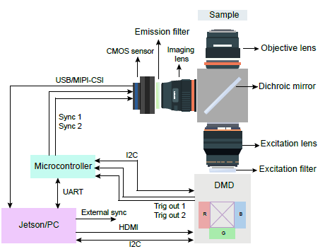
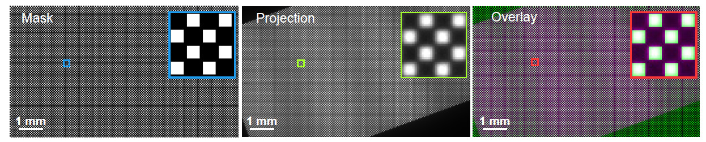

# Hardware Setup

These notes cover the hardware side of running STIMscope on real optics.
The software falls back to off-camera modes (offline ROI segmentation,
trace replay, viewer tools) when this hardware is absent.


*Fig 1a — Photo of the implemented STIMscope platform in the
inverted configuration, with the sample holder, objective, GPU
processing unit (NVIDIA Jetson AGX Orin), microcontroller, DMD, and
stage controller labeled.*


*Fig 1b — Hardware architecture for synchronization, control
and communication between the image sensor (USB / MIPI-CSI), DMD
projector (HDMI for pattern stream, I²C for control), microcontroller
(UART to host, Trig-Out 1/2 to DMD + camera), and NVIDIA Jetson Orin
in real time.*

## What you need

The bill-of-materials goal in the preprint is **< USD $5,000** using
off-the-shelf parts (preprint *Abstract*, *Discussion*).

| Component | What we use | Preprint reference |
|---|---|---|
| Compute | NVIDIA Jetson AGX Orin (JetPack 5 or 6) | Methods § Image processing; Fig 1b |
| Camera | Sony **IMX334** / **IMX290** small-pixel back-illuminated CMOS in an IDS Peak USB3 housing (2 µm pitch, slave-triggered) | Methods § Camera; Fig 1b |
| Stimulator | TI **DLP4710** DMD driven by **DLPC3479** controller (I²C, addr 0x1B) | Methods § DMD; Fig 1b |
| Microcontroller | Microchip **ATSAMD51** (Adafruit Grand Central M4) — clocks every camera exposure | Methods § Microcontroller; Fig 1b |
| Trigger / control | GPIO via `libgpiod` — gpiochip + line numbers env-configurable | Methods § Synchronization; Fig 1b |
| Optics (lens train) | Large-aperture dual-tandem lenses, optimal f/4, Nikon F-mount | Methods § Optical design; Fig 1c |
| Dichroic | Custom dual-band (Union Optic, 50 mm) | Methods § Optical design |

The exact part numbers / camera model / projector / lens train depend
on your optical setup. The software side described here is fixed.

## IDS Peak SDK installation

Hardware mode needs the IDS Peak SDK installed in **two** places:

1. **`.deb` at the repo root** — used at *image build* time. The
   container needs the headers and library stubs to install the Python
   bindings. Drop the ARM64 IDS Peak `.deb` you downloaded from IDS
   (see [Install · prerequisites](Install#prerequisites)) at the repo
   root before `./build.sh`. The exact filename it expects is the one
   matched in
   [`Dockerfile`](https://github.com/Aharoni-Lab/STIMscope/blob/main/Dockerfile).
2. **Installed SDK on the host Jetson** at `/opt/ids-peak` (or
   wherever your install lands). The Docker compose file bind-mounts
   the host install into the container at runtime so the actual `.so`
   libraries and `.cti` transport-layer files are available.

```bash
# (1) Install the .deb on the host so /opt/ids-peak gets populated
sudo dpkg -i ids-peak_*_arm64.deb || true
sudo apt-get install -f -y

# (2) If your SDK ended up somewhere other than /opt/ids-peak, point at it:
export IDS_PEAK_PATH=/path/to/your/ids-peak
```

The container's `entrypoint.sh` auto-discovers `.so` libraries +
`.cti` transport-layer files under whatever path is mounted, sets
`LD_LIBRARY_PATH` and `GENICAM_GENTL64_PATH`, and installs the
`ids_peak`, `ids_peak_ipl`, `ids_peak_afl` Python bindings on first
run if missing.

To verify after starting:

```bash
lsusb | grep IDS
# Should show a uEye / IDS device.
ls /opt/ids-peak/lib/
# Should list arm64 .so files.
```

If the GUI launches but Camera dropdown is empty, see
[Troubleshooting / IDS Peak camera not detected](Troubleshooting#ids-peak-camera-not-detected).

## DMD projector

The DMD is driven by a custom C++ engine at
[`STIMscope/ZMQ_sender_mask/main.cpp`](https://github.com/Aharoni-Lab/STIMscope/blob/main/STIMscope/ZMQ_sender_mask/main.cpp)
that listens on three ZMQ sockets (PULL for mask frames, REP for
homography updates, PUB for engine status). Default endpoints are
defined in
[`STIMscope/STIMViewer_CRISPI/CS/core/projector.py`](https://github.com/Aharoni-Lab/STIMscope/blob/main/STIMscope/STIMViewer_CRISPI/CS/core/projector.py)
(`DEFAULT_MASK_ENDPOINT`, `DEFAULT_HOMOGRAPHY_ENDPOINT`); the engine
binary accepts override flags — see its argument parser in `main.cpp`.

The engine is built once during the Docker image build (`make
rebuild-projector` rebuilds it on the host without a full image
rebuild). The Python side talks to it through
[`projector_client.py`](https://github.com/Aharoni-Lab/STIMscope/blob/main/STIMscope/STIMViewer_CRISPI/projector_client.py).
For wire-format details see
[Hardware Interfaces · Projector ↔ Python ↔ C++ (ZMQ)](Hardware-Interfaces#projector--python--c-zmq).

DMD configuration over I²C uses the TI DLPC3479 protocol per the
DLPU081A datasheet. The Python driver lives at
[`STIMscope/ZMQ_sender_mask/dlpc_i2c.py`](https://github.com/Aharoni-Lab/STIMscope/blob/main/STIMscope/ZMQ_sender_mask/dlpc_i2c.py).
Documented quirks versus the datasheet are folded into the wrappers
that hit them — read the source for the current list.

The default ZMQ endpoints must not be changed without updating both
the C++ engine and the Python clients in lockstep.

## Illumination (DMD-internal)

The DMD's on-board LED bank is the illumination source for both
stimulation and imaging. There are no separate RED / BLUE GPIO pins
on this platform — channel selection happens **inside the projector
engine** via DLPC3479 I²C opcode `0x96` byte 3 (Illumination Select).
The operator-facing surface is the `LED Color` dropdown on the main
button bar; items + raw bytes are defined in
[`qt_interface_mixins/button_bar.py`](https://github.com/Aharoni-Lab/STIMscope/blob/main/STIMscope/STIMViewer_CRISPI/qt_interface_mixins/button_bar.py).

For temporal alternation between RED (stim) and BLUE (observe)
during a run, a daemon thread fires
`dlpc_i2c.fast_phase_switch` so the visible LED tracks the mask-side
alternation; see
[`qt_interface_mixins/triggers.py`](https://github.com/Aharoni-Lab/STIMscope/blob/main/STIMscope/STIMViewer_CRISPI/qt_interface_mixins/triggers.py)
(`_start_temporal_alt_thread`). Phase duration is tunable via the
`STIM_TEMPORAL_PHASE_MS` env var.

## GPIO (libgpiod) — trigger lines only

GPIO is used **only** for the camera and downstream-sync trigger
lines. The C++ projector engine asserts edges on the lines selected at
startup. All addressing is env-overridable so the same image runs on
different Jetson carrier boards without recompilation:

| Env var | Purpose |
|---|---|
| `STIM_GPIO_CHIP` | Which gpiochip device |
| `STIM_CAM_LINE` | Line that fires the camera trigger |
| `STIM_PROJ_LINE` | Line that drives the projector trigger out |

Defaults are defined where the engine subprocess is launched —
[`qt_interface_mixins/triggers.py`](https://github.com/Aharoni-Lab/STIMscope/blob/main/STIMscope/STIMViewer_CRISPI/qt_interface_mixins/triggers.py).
See [Portability](Portability) for the full env-var surface.

## Calibration


*Fig 4b — A 1 mm calibration grid: the desired camera-space
mask (left), the warped projected pattern after applying the
camera→projector homography H (middle), and the overlay seen by the
camera (right). Reported targeting accuracy is RMS **0.46 px ≈ 1.3 µm**
across ~85 000 targets on a 1936 × 1096 field (preprint Fig 4c).*

Calibration is fully autonomous from the GUI — the operator does
**not** place a physical board anywhere in the optical path. The DMD
projects a ChArUco board image (loaded from disk by the GUI), the
camera observes the projected pattern, and the homography is computed
from that projector→camera correspondence. See
[`qt_interface_mixins/projection_controls.py`](https://github.com/Aharoni-Lab/STIMscope/blob/main/STIMscope/STIMViewer_CRISPI/qt_interface_mixins/projection_controls.py)
(`_calibrate` method) for the exact dispatch, and
[`calibration.py`](https://github.com/Aharoni-Lab/STIMscope/blob/main/STIMscope/STIMViewer_CRISPI/calibration.py)
for the detector + homography solver.

The output is a typed `CalibrationResult` (no silent `np.eye(3)`
fallback). Re-run calibration any time the optical path is disturbed.

The DMD also supports a separate **Structured-Light Calibrate** flow
(`Structured-Light Calibrate` button → `_sl_calibrate` in
[`qt_interface_mixins/sl_calibrate.py`](https://github.com/Aharoni-Lab/STIMscope/blob/main/STIMscope/STIMViewer_CRISPI/qt_interface_mixins/sl_calibrate.py))
that projects a sequence of sinusoidal phase patterns to build a
per-pixel projector↔camera LUT instead of a single homography.

## Verifying the full loop end-to-end

After GUI launch:

1. Camera control panel should show your IDS Peak device.
2. Click **Calibrate** → the DMD projects the ChArUco board; success
   is reported in the live engine/mask log as
   `ArUco markers: reference=48, captured=N` (N > 4),
   `Homography: M/M inliers (X%)`, and
   `Saved homography: .../Assets/Generated/homography_cam2proj.npy`.
   A failure logs `too few markers detected` — check board placement
   and lighting.
3. Click **Project ON** with a mask loaded → confirm the DMD displays
   the mask.
4. Click **Start Projector Trigger** → confirm camera frames arrive
   in step with projector frames (hardware-trigger acquisition mode).
5. Use **Pixel Probe** or the diagnostics under **Troubleshooting**
   for round-trip verification.

If any step hangs or fails silently, the live log at
`/tmp/crispi-latest.log` (after `make logs-tail`) is the first place
to look.
