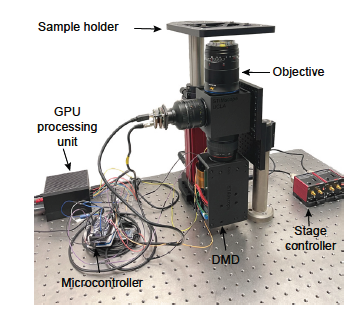

# STIMscope

**STIMscope** — the Spatio-Temporal Illumination Microscope — is an
open-source platform for simultaneous imaging and patterned optical
stimulation. This repository packages it as a Docker distribution for
NVIDIA Jetson: the Qt GUI, the C++ projector engine, the calibration
suite, live trace extraction, hardware diagnostics, and the full set
of operator workflows.

## What you can do with it

The GUI exposes a wide feature surface. Each capability is independent —
operators combine them based on the experiment, not in a fixed sequence.

| Page | When to read |
|---|---|
| [Features](Features) | Browsing what the platform can do |
| [GUI Reference](GUI-Reference) | Looking up what a specific button or dialog does |
| [Install](Install) | First-time Docker setup on a Jetson |
| [Hardware Setup](Hardware-Setup) | Physical wiring + IDS Peak SDK install |
| [Hardware Interfaces](Hardware-Interfaces) | Protocol-level reference (ZMQ wire, I²C opcodes, GPIO) |
| [Architecture](Architecture) | Conceptual + implementation architecture |
| [Portability](Portability) | Environment-variable surface for retargeting to a different host |
| [Troubleshooting](Troubleshooting) | Common errors and how to recover |
| [Docker Image](Docker-Image) | Pulling pre-built images (when available) |
| [Citation](Citation) | How to cite the platform |

## Operating modes

- **GUI (interactive)** — the everyday operator path. Boots on
  `docker-compose up gui`.

## Quick reference

- License: GPL-3.0 (see [LICENSE](https://github.com/Aharoni-Lab/STIMscope/blob/main/LICENSE))
- Issues / bugs: <https://github.com/Aharoni-Lab/STIMscope/issues/new/choose>
- Hardware portability surface: [docs/PORTABILITY.md](https://github.com/Aharoni-Lab/STIMscope/blob/main/docs/PORTABILITY.md)
